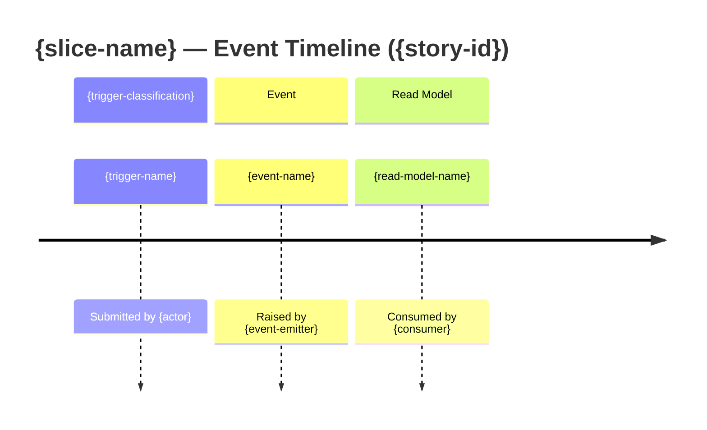

# Event Model Template

Used by the `solution-architect` persona at Phase 4 (EVENT MODELING).

This template is intentionally generic. Do NOT inline domain-specific names (`CheckEligibility`, `Driver`, etc.) here — they belong to the per-story output produced by the persona.

---

## Caller-supplied slots

| Slot | Source | Notes |
|---|---|---|
| `{story-id}` | story metadata | e.g. `story-41` |
| `{story-title}` | story metadata | short title |
| `{slice-name}` | persona Phase 4 | one slice per deliverable |
| `{trigger-name}` | persona Phase 4 (provisional) | imperative for commands, interrogative for queries |
| `{trigger-classification}` | **provisional during Phase 4; ratified by ADR at Phase 7** | one of: `Command` \| `Query` |
| `{actor}` | persona Phase 4 | who initiates the trigger |
| `{event-name}` | persona Phase 4 | past tense; one or more |
| `{event-emitter}` | persona Phase 4 (provisional) | aggregate root or domain service; ratified by ADR |
| `{read-model-name}` | persona Phase 4 | the visible outcome |
| `{consumer}` | persona Phase 4 | who reads the model |

---

## Template body

```markdown
# Event Model — {story-id}: {story-title}

**Story:** {story-id}
**Date:** {YYYY-MM-DD}

## Slice: {slice-name}



## Trigger → {trigger-classification} → Event → Read Model Mapping

| Step | Name | Description |
|---|---|---|
| Trigger | {actor} action | {one-line description} |
| {trigger-classification} | `{trigger-name}` | {payload summary} |
| Event | `{event-name}` | {outcome summary} |
| Read Model | `{read-model-name}` | {return shape summary} |

## Vocabulary cross-check (Phase 9 input)

- Trigger classification (`Command` \| `Query`): MUST match the ADR that ratifies the read/write split for this slice.
- Event emitter (aggregate root \| domain service): MUST match the ADR that ratifies the aggregate boundary.

If Phase 9 reports `CLASSIFICATION_DRIFT` on any row above, this file is rewritten to align with the ADR before persistence.
```

---

## Forbidden in this template

- Hard-coded domain names (`CheckEligibility`, `Eligibility`, `Driver`, `Vehicle`, …).
- Hard-coded values for `{trigger-classification}` outside the slot (no `section Command` baked in).
- Examples that would seed the LLM toward a specific classification before the ADR ratifies it.
