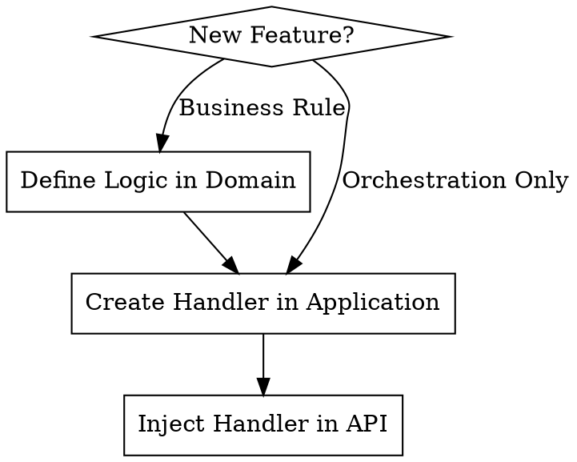

# Clean Architecture in .NET

## Overview

Clean Architecture organizes code into independent layers (Domain → Application → Infrastructure → API).

**The Iron Law**: Violating layer boundaries is a failure. If API references Application or Domain references Infrastructure, delete the change and start over.

## When to Use

- Business logic is leaking into Controllers or Repositories
- Circular dependencies occur between projects
- Need to isolate core business rules from external frameworks (EF Core, APIs)
- Autonomy is required: sealed Domain objects, strongly-typed IDs

## Implementation Flow



## Core Pattern (CQRS)

Commands (writes) and Queries (reads) separate side-effects:

```csharp
// Application/Features/Orders/PlaceOrderCommandHandler.cs
public sealed class PlaceOrderCommandHandler : ICommandHandler<PlaceOrderCommand, OrderId>
{
    private readonly IOrderRepository _repository; // Interface defined in Application/Domain
    
    public async Task<OrderId> HandleAsync(PlaceOrderCommand cmd, CancellationToken ct)
    {
        var order = Order.Create(cmd.OrderId, cmd.CustomerName);
        await _repository.AddAsync(order, ct);
        return order.Id;
    }
}

// API/OrdersEndpoints.cs — inject ICommandBus (never ICommandHandler<,> directly)
app.MapPost("/orders", async (PlaceOrderCommand cmd, ICommandBus bus) 
    => Results.Created($"/orders/{await bus.PublishAsync<PlaceOrderCommand, OrderId>(cmd)}"));

// Queries follow the same rule — inject IQueryBus
app.MapGet("/orders/{id}", async (Guid id, IQueryBus bus)
    => Results.Ok(await bus.SendAsync<GetOrderQuery, OrderViewModel>(new GetOrderQuery(new OrderId(id)))));

// Both buses resolve via Infrastructure DI. API never references Application assembly.
```

## Layer Responsibilities

| Layer | Purpose | Allowed Dependencies |
|-------|---------|----------------------|
| **Domain** | Pure business logic, aggregates | None (ZERO transitive references) |
| **Application** | Use cases, Handler orchestration | Domain |
| **Infrastructure** | Database, DI registration, CQRS Bus | Application, Domain |
| **API** | Endpoints, JSON mapping | **Infrastructure** (Transitive: Application, Domain) |

## The Dependency Chain (Transitive Access)

The architecture follows a strict outward-in dependency flow:
**API** → **Infrastructure** → **Application** → **Domain**

- **API** has access to everything below it (Infrastructure, Application, Domain).
- **Infrastructure** has access to Application and Domain.
- **Application** has access to Domain.
- **Domain** remains pure with **zero** project dependencies.

**CRITICAL**: Just because a layer *can* see another via transitive reference doesn't mean it *should* use its concrete types. 
- API should only use **Interfaces** from Application/Domain.
- Always follow the **Iron Law** and **Red Flags** below.

## Rationalization Table

| Excuse | Reality |
|--------|---------|
| "Injecting ICommandHandler<,> directly is simpler" | Always use ICommandBus / IQueryBus — consistent indirection, easier to intercept (logging, validation). |
| "It's just one small service" | Small leaks become circular dependency nightmares. |
| "Referencing Application in API is faster" | It bypasses the Bus/Handler pattern and couples contract to implementation. |
| "Domain needs this NuGet package" | If it's not a primitive/System lib, it doesn't belong in Domain. |

## Red Flags - STOP and Start Over

- `using MyApp.Application;` inside API layer files
- `using MyApp.Infrastructure;` inside Domain layer files
- Injecting `ICommandHandler<,>` or `IQueryHandler<,>` directly in API endpoints — use `ICommandBus` / `IQueryBus`
- Non-sealed classes in Domain
- Handlers performing HTTP calls directly (use an Infrastructure service via interface)

## Common Mistakes

| Mistake | Fix |
|---------|-----|
| Handler not found by DI | Handler must be listed explicitly in `AddInfrastructure()` via `AddHandler<T>()` |
| `using MyApp.Application;` in API | Remove it — inject `ICommandBus` / `IQueryBus` via DI |
| `Guid` used in handler return type | Use strongly typed ID (`OrderId`, `ProductId`) |
| Read result named `ProductDto` | Name it `ProductViewModel` to distinguish from transfer objects |
| `typeof(Product).Assembly` in tests | Use `typeof(IApplicationMarker).Assembly` for reliable discovery |
| Non-sealed Domain classes | All Domain classes must be `sealed` (enforced by NetArchTest) |
| Handler contains `if`/business logic | Delegate to Domain aggregate methods — handlers orchestrate only |

---

## References

- [Architecture Layers](references/architecture-layers.md) — Dependency rules, marker interfaces, layer tests
- [CQRS Patterns](references/cqrs-patterns.md) — Handler interfaces and examples
- [Convention-Based DI](references/convention-based-di.md) — Auto-discovery, Bus interfaces, full DI setup
- [Layer Responsibilities](references/layer-responsibilities.md) — Full rules for each layer with DDD context
- [Project Structure](references/project-structure.md) — File and folder conventions per layer
- [NetArchTest Rules](references/netarchtest-rules.md) — Automated boundary enforcement
- [DDD Patterns](references/ddd.md) — Aggregates, factory methods, domain events (optional)
- [Shared Kernel](references/shared-kernel.md) — Multi-context shared abstractions (optional)
- [Init Script](scripts/init-project.sh) — Bootstrap a new project (`./init-project.sh MyApp`)
- [ArchitectureTests Template](templates/IntegrationTests/ArchitectureTests.cs) — Drop-in test class

- [CQRS Patterns & Implementation](./references/cqrs-patterns.md) — Handler interfaces, DI discovery, complete implementation examples
- [Architecture Layers & Validation](./references/architecture-layers.md) — Layer separation, NetArchTest tests, marker interfaces
- [Project Structure Guide](./references/project-structure.md) — Folder organization, layer responsibilities
- [SharedKernel Abstraction Platform](./references/shared-kernel.md) — *Optional: shared abstractions (CQRS interfaces, base classes)*
- [DDD: Optional Patterns](./references/ddd.md) — *Optional: Domain-Driven Design patterns (aggregates, factories, value objects, domain events)*


