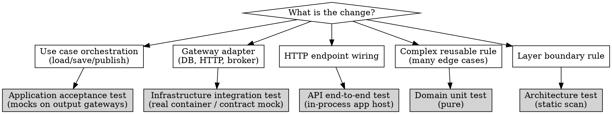

# Clean Architecture Testing

## Overview

Defines **where** to test and **with which doubles** in a Clean Architecture solution. Language-agnostic. Does NOT redefine the TDD cycle — that is owned by `outside-in-tdd`.

**Core principle:** every test enters through **one boundary** and asserts at the next boundary. Choice of double follows the layer, not convenience.

**REQUIRED SUB-SKILL:** Use `outside-in-tdd` for the RED → SYNTHESIZE-GREEN → COMMIT cycle. This skill only routes you to the correct layer and doubles.

## The Iron Rule for Domain Tests

**Default = Application-level acceptance test.** Do NOT write Domain tests by default.

Extract a Domain test ONLY when a business rule:
- Has complex invariants or a large edge-case matrix, AND
- Is extracted into a reusable Policy / Domain Service / Specification.

**NEVER test directly:**
- Constructors (unless they enforce complex invariants)
- Simple value objects (covered by usage in Application acceptance tests)
- Getters / setters / DTOs / ViewModels / passive data structures

A test asserting `new PolicyNumber("abc").value == "abc"` is noise. It tests the compiler, not behavior.

## Test Project Organization

**Rule: exactly two test projects per bounded context**, regardless of language.

| Test project | Targets | Contains |
|---|---|---|
| `<Context>.UnitTest` | Domain + Application | Domain unit tests (rare, extracted rules) + Application acceptance tests (mocks on output gateways, in-memory fakes) |
| `<Context>.IntegrationTest` | Infrastructure + API + Architecture | Infrastructure integration tests (real containers), API end-to-end tests (in-process app host), architecture tests |

**Rationale:**
- `UnitTest` must stay **fast** (< 1 s for the whole suite on a laptop). No I/O, no containers, no network. Run on every save.
- `IntegrationTest` is **slow by design** (containers boot, DB migrations, HTTP). Run on commit / CI.
- **Architecture tests** go into `IntegrationTest` — they are a CI gate, not a tight-loop test.

### Per-language mapping

| Ecosystem | `UnitTest` project | `IntegrationTest` project |
|---|---|---|
| .NET | `tests/<Context>.UnitTest/` csproj | `tests/<Context>.IntegrationTest/` csproj |
| Java (Maven / Gradle) | `<context>-unit-test` module | `<context>-integration-test` module |
| Python | `tests/unit/` package | `tests/integration/` package |
| TypeScript / Node | `test/unit/` workspace | `test/integration/` workspace |

### Multi-context solutions

One pair per bounded context. Shared helpers (fakes, builders) live in a separate non-test project (`TestKit` / `tests-shared`) referenced by both.

### Forbidden combinations

| Wrong | Why |
|---|---|
| Single test project mixing unit + integration | Slow tests pollute the fast loop; developers start skipping the suite |
| Splitting by production layer (`*.Domain.Test`, `*.Application.Test`, …) | Explodes project count, fights the boundary policy |
| End-to-end app host test in `UnitTest` | API tests need full composition — belong in `IntegrationTest` |
| Real container (DB / broker) in `UnitTest` | Breaks the <1 s suite promise |
| Architecture scanner test in `UnitTest` | Architecture tests are a CI gate, not a development loop |

## Testing Strategy per Layer

| Layer | Test type | Entry point | Doubles | Target speed | When to write |
|---|---|---|---|---|---|
| **SharedKernel** | None | — | — | — | Never (interfaces + base classes, no logic) |
| **Domain** | Pure unit (rare) | Policy / Domain Service / Specification | None (real objects) | <10 ms | Only for extracted complex rules |
| **Application** | Acceptance (sociable) | Command / Query handler or UseCase | Mocks on output gateways, hand-written in-memory fakes for stateful reuse | <100 ms | **Default** — one per Gherkin scenario |
| **Infrastructure** | Integration | Gateway adapter (repository, read service, message handler) | Real I/O via containers (DB, broker); external APIs via contract mock server | 1-5 s | One per adapter contract |
| **API** | End-to-end | HTTP endpoint via in-process app host | Real internal stack; contract mock server for downstream externals | 1-5 s | Walking skeleton + one happy path per endpoint |
| **Architecture** | Static analysis | Assembly / module scan | None | <1 s | One rule per constraint, CI gate |

## Doubles Policy (by role, not by library)

| Role | Use for | Never for |
|---|---|---|
| **Real domain object** | Always, at every layer that touches Domain | — |
| **Mock / stub on output gateway** | Output gateways at Application level (repository, dispatcher, external service interfaces) (repositories, dispatchers, external service interfaces) | Domain objects, Application handlers |
| **Hand-written in-memory fake** | Reusable across many Application tests, stateful scenarios | One-off single-test cases |
| **Real container** (DB, broker) | Infrastructure adapter tests exclusively | Application or Domain tests |
| **Contract mock server** (for external APIs / brokers) | Infrastructure adapter tests against externals; API E2E with downstream externals | Internal domain logic, Application handlers |
| **In-process app host** (boots the full API) | API layer end-to-end tests exclusively | Application, Domain, Infrastructure |
| **Architecture scanner** | Architecture tests | Any behavioral test |

Pick one mocking library per solution and stick to it. Same for the app host factory. Mixing libraries across tests is a smell.

## Per-Layer Examples (pseudo-code)

Full runnable .NET examples: [examples-dotnet.md](references/examples-dotnet.md). Same patterns translate directly to Java, Python, TypeScript — the roles are identical.

### Application — acceptance test

```
given repository := mock of IOrderRepository
  and dispatcher := mock of IDomainEventDispatcher
  and handler := new PlaceOrderCommandHandler(repository, dispatcher)

when handler.handle(PlaceOrderCommand(id, "Alice"))

then repository received add(order where order.customerName == "Alice") exactly once
 and dispatcher received dispatch(events containing OrderPlacedEvent) exactly once
```

### Infrastructure — integration test

```
given db := start Postgres container
  and ctx := connect(db.connectionString) and migrate
  and sut := new OrderRepository(ctx)
  and order := Order.create(id, "Alice")

when sut.add(order)

then ctx.orders contains one row with customerName == "Alice"
```

### API — end-to-end test

```
given appHost := boot in-process app host
  and client := appHost.createHttpClient()

when response := client.POST("/orders", { customerName: "Alice" })

then response.status == 201
 and response.location is not null
```

### Architecture — layer rule

```
assert types in DomainAssembly have no dependency on "MyApp.Infrastructure"
  else fail with "Domain must not reference Infrastructure. Violations: ..."
```

## External Contract Mocks (Infrastructure & API)

When an adapter (Infrastructure) or endpoint (API) talks to an external HTTP / gRPC / async API:

- Start a **contract mock server** from the external's published contract (OpenAPI, gRPC proto, AsyncAPI).
- Point the adapter's client at the mock's URL / topic.
- In API end-to-end tests, wire downstream externals to the mock through DI overrides.
- The same contract file can later validate real responses (contract verification).

Out of scope for this skill — see `api-contract-testing` *(upcoming)* for the full pattern.

## Decision Tree — Which Test Layer?



Extended tree with tie-breakers: [doubles-decision-tree.md](references/doubles-decision-tree.md).

## Anti-Patterns

| Anti-pattern | Fix |
|---|---|
| Testing `new ValueObject(x).value == x` | Delete. Covered by usage in Application test. |
| Mocking a domain object | Use the real aggregate. Mock only output gateways. |
| Real container in an Application-level test | Move to Infrastructure layer or use an in-memory fake. |
| Shared global container across test classes | One container per test class, isolated lifecycle. |
| In-process app host used to test a handler | Switch to an Application-level test with mocks. |
| No architecture test guarding layer references | Add the rule. Layer discipline must be enforced by CI, not reviews. |
| In-memory fake DB provider used as Infrastructure test | Infrastructure tests MUST use the real provider via real container. In-memory providers silently accept invalid SQL. |
| One acceptance test covers 5 rules | Split: one Gherkin scenario = one test. |
| Duplicating acceptance coverage with a Domain test on the same rule | Delete the Domain test unless the rule was extracted. |

## Red Flags — STOP

These thoughts signal you're about to violate the policy:

- "I'll add a quick test on this constructor for safety."
- "Let me mock this aggregate to simplify the test."
- "I need an in-memory DB provider here because real containers are slow."
- "This handler test needs a real DB to verify my query."
- "Architecture tests slow down the build — I'll skip them."
- "A Domain test per value object will bump coverage."

**All of these mean: stop and re-read the table.** Coverage is not the goal. Behavior at the correct boundary is.

## References

- [examples-dotnet.md](references/examples-dotnet.md) — full runnable .NET examples (FakeItEasy, Testcontainers, in-process app host, architecture scanner)
- [architecture-rules.md](references/architecture-rules.md) — complete architecture rule set (.NET flavour; rules themselves are language-agnostic)
- [doubles-decision-tree.md](references/doubles-decision-tree.md) — extended decision tree with tie-breakers
