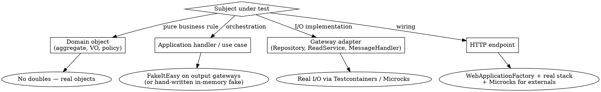
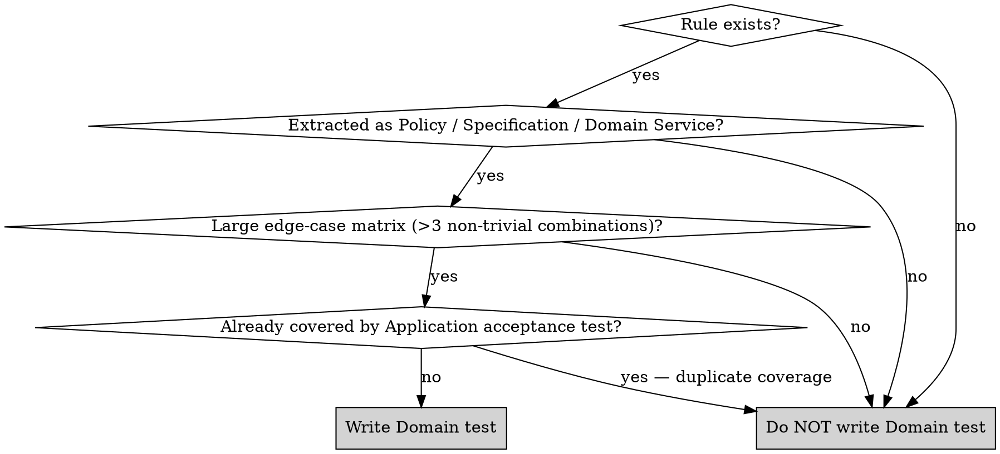

# Doubles Decision Tree (Extended)

Use this when the main decision tree in `SKILL.md` does not answer your case.

## Root Question: What boundary does the test cross?

## Tie-breakers

### "FakeItEasy vs hand-written fake at Application level"

| Condition | Choose |
|---|---|
| Single test, simple stub (one call, one return) | FakeItEasy |
| >3 tests need the gateway to behave as a store (add / find / update) | Hand-written in-memory fake |
| Test asserts "was the gateway called with X?" | FakeItEasy (verification built-in) |
| Test asserts state ("after N commands, repository contains Y") | In-memory fake (then `repo.GetAll()` in assertion) |

### "In-memory fake vs Testcontainers"

| Layer | Choose | Reason |
|---|---|---|
| Application | In-memory fake (or FakeItEasy) | Acceptance tests must stay <100 ms; the DB is not under test |
| Infrastructure | Testcontainers | The adapter IS the I/O boundary — in-memory defeats the purpose |

`InMemoryDbContext` (EF Core in-memory provider) is **never** acceptable for Infrastructure tests: it accepts invalid SQL, ignores constraints, and silently diverges from the production provider.

### "WebApplicationFactory vs Application test"

| Intent | Choose |
|---|---|
| Verify HTTP status code, route, JSON shape, DI wiring | WebApplicationFactory (API layer) |
| Verify business rule, orchestration, domain event dispatch | Application layer (FakeItEasy) |

If a `WebApplicationFactory` test is used to verify a business rule, it is misplaced — rewrite as an Application test.

### "Microcks vs FakeItEasy at Infrastructure"

| External type | Choose |
|---|---|
| Real HTTP / gRPC API we do not own | Microcks (contract comes from their OpenAPI / proto / AsyncAPI) |
| gRPC / HTTP API we own but lives in another service | Microcks (share the contract) |
| Internal gateway whose implementation we are testing | Neither — this is Application-level; use FakeItEasy |
| Kafka / RabbitMQ topic exchange | Microcks async (contract testing on messages) |

### "Should I add a Domain test?"

The gate is deliberately restrictive. Domain tests are the exception, not the rule.

## Cheat Sheet

| You are writing… | Layer | Doubles |
|---|---|---|
| `PlaceOrderCommandHandlerTests` | Application | FakeItEasy on `IOrderRepository`, `IDomainEventDispatcher` |
| `OrderRepositoryTests` | Infrastructure | PostgreSQL Testcontainer |
| `PaymentGatewayAdapterTests` | Infrastructure | Microcks REST mock from OpenAPI |
| `OrderPlacedConsumerTests` | Infrastructure | RabbitMQ Testcontainer + Microcks async contract |
| `OrdersEndpointsTests` | API | `WebApplicationFactory<Program>` + Microcks for externals |
| `ArchitectureTests` | Architecture | None — NetArchTest |
| `EligibilityPolicyTests` | Domain | None — real `EligibilityPolicy`, only if extracted with ≥3 edge cases |
