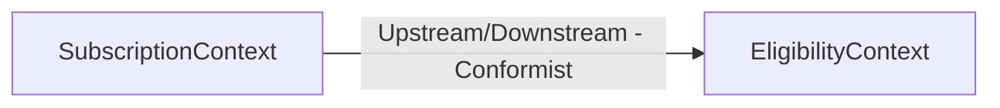

# Context Map — MonAssurance

**Date:** 2026-06-02
**Milestone:** v0.3-souscription

## Bounded Contexts

| Context | Subdomain type | Description |
|---|---|---|
| EligibilityContext | Core | Évaluation de l'éligibilité du conducteur à l'assurance |
| SubscriptionContext | Core | Gestion de la demande de souscription et tarification |

## Context Map

### Relation : SubscriptionContext → EligibilityContext

| Attribut | Valeur |
|---|---|
| Pattern | Upstream/Downstream — Conformist |
| Upstream | EligibilityContext |
| Downstream | SubscriptionContext |
| Interface | `EligibilityViewModel.IsEligible: bool` (résultat de `CheckEligibilityQueryHandler`) |
| Justification | Le SubscriptionContext consomme le résultat d'éligibilité tel quel, sans transformation. Le contrat (`IsEligible: bool`) est simple et stable. Un ACL sera ajouté si le modèle Eligibility évolue de façon incompatible. |
| ADR de référence | ADR-002 |

## Namespaces par Bounded Context

### EligibilityContext (existant)

- `MonAssurance.Domain.Eligibility` — Driver, Vehicle, VehicleType, EligibilityResult, EligibilityPolicy
- `MonAssurance.Application.Eligibility.Queries.CheckEligibility` — CheckEligibilityQuery, CheckEligibilityQueryHandler, EligibilityViewModel

### SubscriptionContext (nouveau — v0.3-souscription)

- `MonAssurance.Domain.Subscription` — SubscriptionRequest (Aggregate Root), SubscriptionReference (VO), DriverId (VO), VehicleDetails (VO), PricingPolicy (Domain Service), PriceQuote (VO), SubscriptionRequestInitiated (Domain Event), SubscriptionRequestRejected (Domain Event)
- `MonAssurance.Application.Subscription.Commands.InitiateSubscriptionRequest` — InitiateSubscriptionRequestCommand, InitiateSubscriptionRequestCommandHandler
- `MonAssurance.Application.Subscription.Queries.GetInsurancePriceQuote` — GetInsurancePriceQuoteQuery, GetInsurancePriceQuoteQueryHandler, InsurancePriceQuoteViewModel
- `MonAssurance.Infrastructure` — ISubscriptionRequestRepository (interface), InMemorySubscriptionRequestRepository (implémentation)
