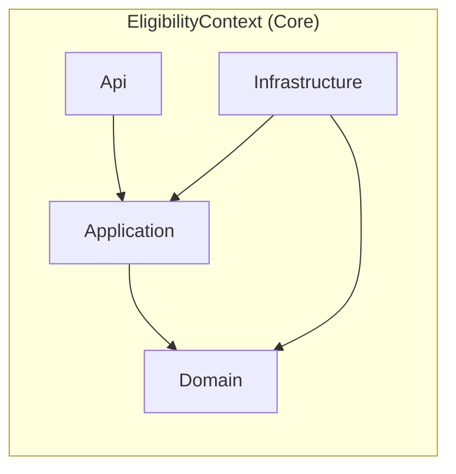

# Context Map — MonAssurance

**Last updated:** 2026-05-26  
**Milestone:** v0.3-legal-minimum-age

---

## Bounded Contexts

| Context | Subdomain Type | Status |
|---|---|---|
| EligibilityContext | Core | Active |

### EligibilityContext

**Responsibility:** Determines whether a driver is eligible to insure a given
vehicle under current legal and underwriting rules. Owns the `Driver`, `Vehicle`,
`EligibilityPolicy`, and `EligibilityResult` domain objects.

**Ubiquitous Language:**
- driver, vehicle, eligibility, minimum age, rejection reason, high-power motorcycle, electric scooter

**Internal layers (Clean Architecture):**

```
EligibilityContext
├── Domain     — Driver, Vehicle, VehicleType, EligibilityPolicy, EligibilityResult
├── Application — CheckEligibilityQuery, CheckEligibilityQueryHandler, EligibilityViewModel
├── Infrastructure — CommandBus, QueryBus, DependencyInjection
└── Api        — EligibilityEndpoints
```

---

## Context Map Diagram

Only one bounded context is currently active. The diagram reflects the internal
layer dependency direction (outer layers depend on inner; Domain has no outward
dependencies).



---

## Future Context Candidates

| Context | Trigger | Relationship to EligibilityContext |
|---|---|---|
| PolicyContext | Story introducing policy issuance | Downstream of EligibilityContext via ACL |
| BillingContext | Story introducing premium calculation | Downstream of PolicyContext |

These are **not yet active** — no stories exist for them in the current milestone.
They are noted only to anticipate split decisions.
