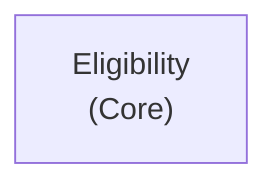

# Context Map — MonAssurance

**Last updated:** 2026-05-30
**Stories covered:** story-52

## Bounded Contexts

| Context | Subdomain type | Description |
|---|---|---|
| Eligibility | Core | Evaluates whether a driver is eligible for vehicle insurance. Enforces age and experience rules. |

## Context Map Diagram

> Single bounded context at this milestone. No upstream/downstream relationships introduced.
> Future stories may introduce a Policy context (downstream of Eligibility) when policy issuance is in scope.

## Context Assignments

| Story | Bounded Context |
|---|---|
| story-52 | Eligibility |
