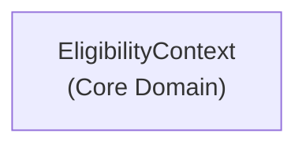

# Context Map — MonAssurance

**Date:** 2026-05-30
**Stories couvertes :** story-57

## Bounded Contexts identifiés

| Bounded Context | Type de sous-domaine | Description |
|---|---|---|
| `EligibilityContext` | **Core** | Moteur d'éligibilité : règles d'âge, d'expérience, de type de véhicule |

## Carte de contexte

> **Note :** Avec une seule story dans ce milestone, un seul bounded context est identifié. La carte sera enrichie au fur et à mesure que les stories de policy (tarification, souscription, sinistres) seront traitées.

## Attribution des stories

| Story | Bounded Context |
|---|---|
| story-57 — Âge légal minimal 21 ans | `EligibilityContext` |
