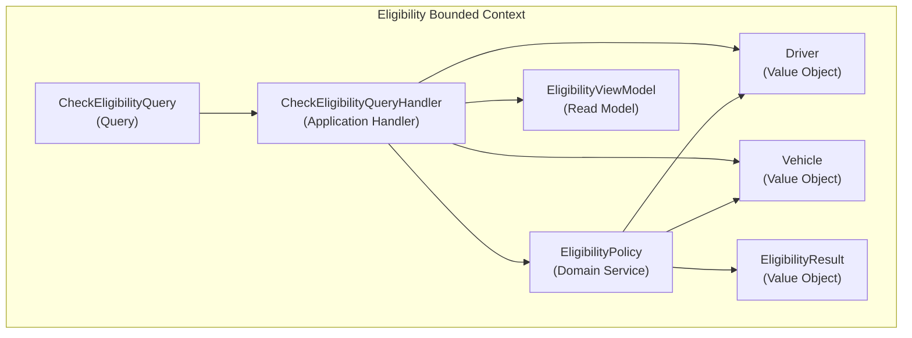

# Diagrams — story-52: Legal Minimum Driver Age (21 years)

**Story:** story-52
**Date:** 2026-05-30

## Eligibility — Component Diagram

## Classification table (Phase 9 input)

| Concept | Classification (source: ADR) | Story impact |
|---|---|---|
| `CheckEligibilityQuery` | `Query` (adr-001) | reuse as-is |
| `CheckEligibilityQueryHandler` | Application Handler (adr-001) | reuse as-is |
| `EligibilityPolicy` | `Domain Service` (adr-002) | reuse as-is |
| `Driver` | `Value Object` (adr-002) | reuse as-is |
| `Vehicle` | `Value Object` (adr-002) | extend — `MinimumAge()` returns 21 for Car/Motorcycle |
| `EligibilityResult` | `Value Object` (adr-002) | reuse as-is |
| `EligibilityViewModel` | `Read Model` (adr-001) | reuse as-is |

## Vocabulary cross-check

Every classification on a node label matches the classification recorded in its source ADR above. Phase 9 verifies this via grep.
