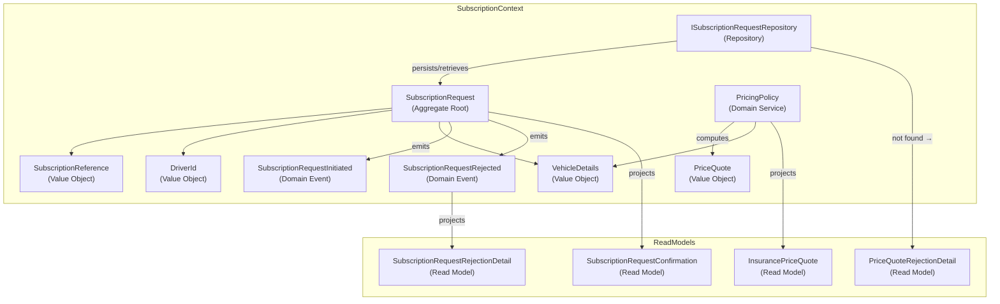

# Diagrams — STORY-69: Offre de Souscription

**Story:** STORY-69-A, STORY-69-B
**Date:** 2026-06-02

---

## SubscriptionContext — Component Diagram

---

## Classification table (Phase 9 input)

| Concept | Classification (source: ADR) | Story impact |
|---|---|---|
| `SubscriptionRequest` | `Aggregate Root` (adr-001) | added |
| `SubscriptionReference` | `Value Object` (adr-001) | added |
| `DriverId` | `Value Object` (adr-001) | added |
| `VehicleDetails` | `Value Object` (adr-001) | added |
| `PricingPolicy` | `Domain Service` (adr-003) | added |
| `PriceQuote` | `Value Object` (adr-003) | added |
| `SubscriptionRequestInitiated` | `Domain Event` (adr-001) | added |
| `SubscriptionRequestRejected` | `Domain Event` (adr-001) | added |
| `ISubscriptionRequestRepository` | `Repository` (adr-001) | added |
| `SubscriptionRequestConfirmation` | `Read Model` (adr-001) | added |
| `InsurancePriceQuote` | `Read Model` (adr-003) | added |
| `SubscriptionRequestRejectionDetail` | `Read Model` (adr-001) | added |
| `PriceQuoteRejectionDetail` | `Read Model` (adr-003) | added |
| `InitiateSubscriptionRequest` | `Command` (adr-001) | added |
| `GetInsurancePriceQuote` | `Query` (adr-003) | added |

---

## Vocabulary cross-check

Every `{classification}` on a node label MUST equal the classification recorded in its source ADR row above. Phase 9 enforces this via grep; any divergence triggers back-propagation or HALT.
