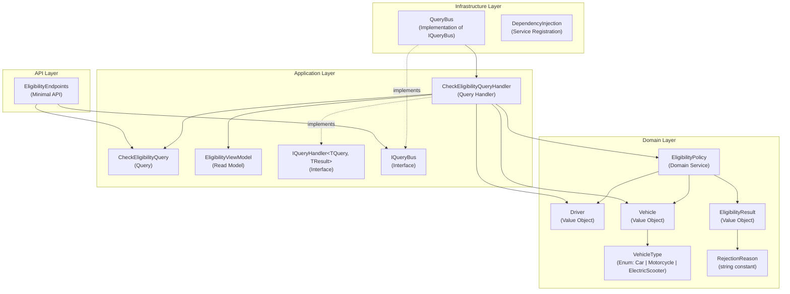
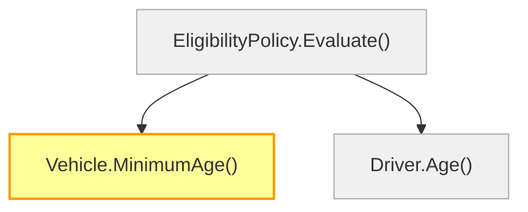

# Diagrams — STORY-41: Update minimum driving age to 21

**Story:** STORY-41  
**Milestone:** v0.3-legal-minimum-age  
**Date:** 2026-05-26

---

## EligibilityContext — Component Diagram

---

## STORY-41 Change Localisation

The rule change is **entirely contained** within `Vehicle.MinimumAge()` in the
Domain layer. No application, infrastructure, or API layer components change.

**Legend:**
- 🟡 Yellow — modified by STORY-41
- ⬜ Grey — unchanged

---

## Aggregate / Value Object / Domain Service Classification

| Type | Name | Role | STORY-41 Impact |
|---|---|---|---|
| Domain Service | `EligibilityPolicy` | Orchestrates eligibility rules; has no mutable state | None — logic delegates to `Vehicle.MinimumAge()` |
| Value Object | `Driver` | Holds date of birth and license years; equality by value composition, no lifecycle identity in EligibilityContext | None |
| Value Object | `Vehicle` | Holds vehicle type and engine power; **owns `MinimumAge()` rule** | **Modified** — returns 21 for Car/Motorcycle |
| Value Object | `EligibilityResult` | Wraps `Eligible`/`Ineligible` + optional rejection reason | None |
| Enum | `VehicleType` | `Car`, `Motorcycle`, `ElectricScooter` | None |
