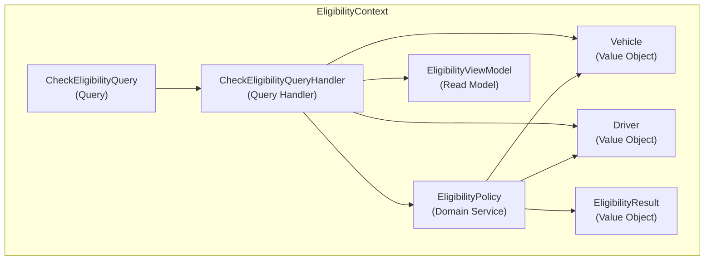

# Diagrams — story-57 : Âge légal minimal porté à 21 ans pour les véhicules standards

**Story:** story-57
**Date:** 2026-05-30

## EligibilityContext — Diagramme de composants

## Table de classification (entrée Phase 9)

| Concept | Classification (source : ADR) | Impact story-57 |
|---|---|---|
| `Vehicle` | `Value Object` (adr-001) | modified — `MinimumAge()` retourne 21 au lieu de 18 pour les non-trottinettes |
| `Driver` | `Value Object` (adr-001) | none |
| `EligibilityPolicy` | `Domain Service` (adr-001) | none |
| `EligibilityResult` | `Value Object` (adr-001) | none |
| `CheckEligibilityQuery` | `Query` (adr-002) | none |
| `CheckEligibilityQueryHandler` | `Query Handler` (adr-002) | none |
| `EligibilityViewModel` | `Read Model` (adr-002) | none |

## Vocabulary cross-check

Chaque label `(classification)` sur un nœud DOIT être égal à la classification enregistrée dans la colonne ADR ci-dessus. La Phase 9 applique ce contrôle via grep ; toute divergence déclenche une back-propagation ou un HALT.
