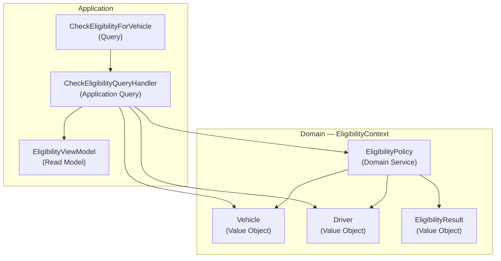

# Diagrams — story-72 : Âge légal de conduite porté à 21 ans

**Story:** story-72
**Date:** 2026-06-02

## EligibilityContext — Component Diagram

## Classification table (Phase 9 input)

| Concept | Classification (source: ADR) | Story impact |
|---|---|---|
| `Vehicle` | `Value Object` (adr-001) | modified — `MinimumAge()` : 18 → 21 pour non-trottinette |
| `Driver` | `Value Object` (adr-001) | none |
| `EligibilityResult` | `Value Object` (adr-001) | none |
| `EligibilityPolicy` | `Domain Service` (adr-002) | none |
| `CheckEligibilityForVehicle` | `Query` (adr-002) | none |
| `EligibilityViewModel` | `Read Model` (adr-002) | none |
| `CheckEligibilityQueryHandler` | `Application Query` (adr-002) | none |

## Vocabulary cross-check

Chaque classification dans les nœuds du diagramme DOIT correspondre à la classification enregistrée dans la colonne ADR ci-dessus. Phase 9 applique ce contrôle par grep ; toute divergence déclenche une back-propagation ou un HALT.
