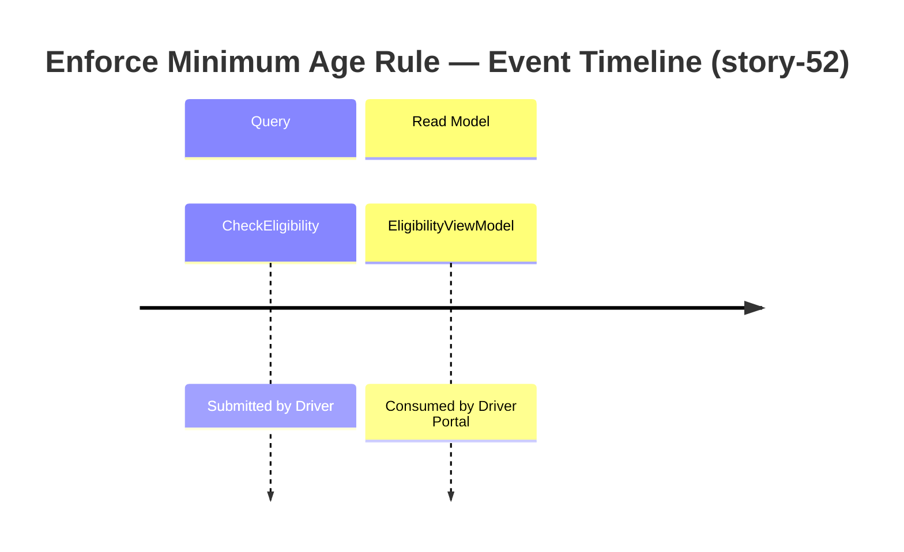

# Event Model — story-52: Legal Minimum Driver Age (21 years)

**Story:** story-52
**Date:** 2026-05-30

## Slice: Enforce Minimum Age Rule

## Trigger → Query → Read Model Mapping

| Step | Name | Description |
|---|---|---|
| Trigger | Driver action | Driver submits eligibility check request with date of birth, licence years, vehicle type and power |
| Query | `CheckEligibility` | Payload: `dateOfBirth`, `vehicleType`, `power`, `licenseYears` |
| Event | _(none — pure read; no state mutation)_ | Eligibility evaluation does not raise a domain event |
| Read Model | `EligibilityViewModel` | Returns `isEligible: bool` and optional `rejectionReason: string`; mapped from domain `EligibilityResult` (Value Object) by the query handler |

## Vocabulary cross-check (Phase 9 input)

- Trigger classification (`Query`): ratified by ADR-001 — the eligibility check is a read-only evaluation with no state mutation.
- Event emitter: none — EligibilityPolicy is a Domain Service that evaluates rules and returns a result; it does not raise domain events. Ratified by ADR-002.
