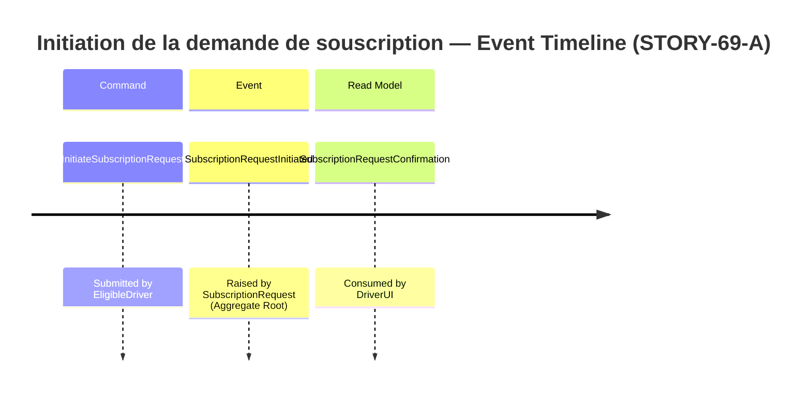
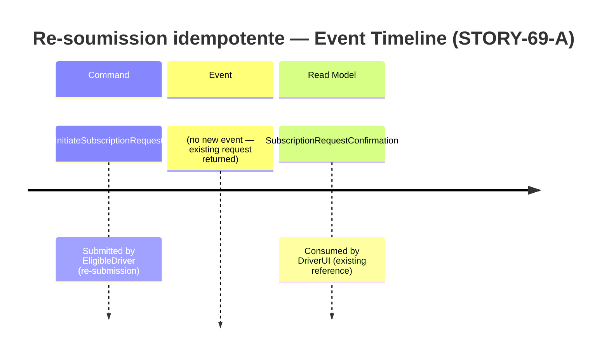
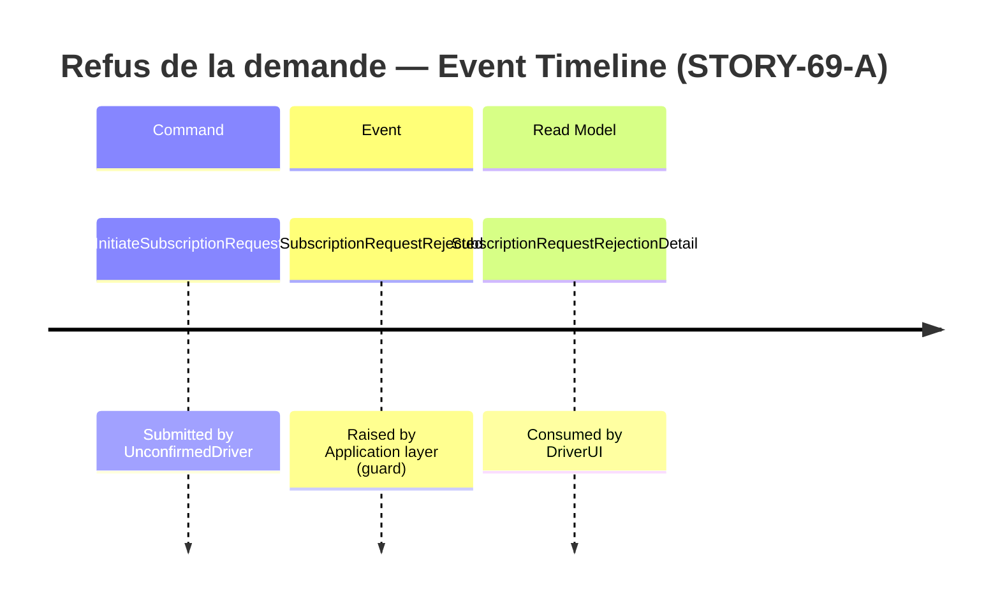
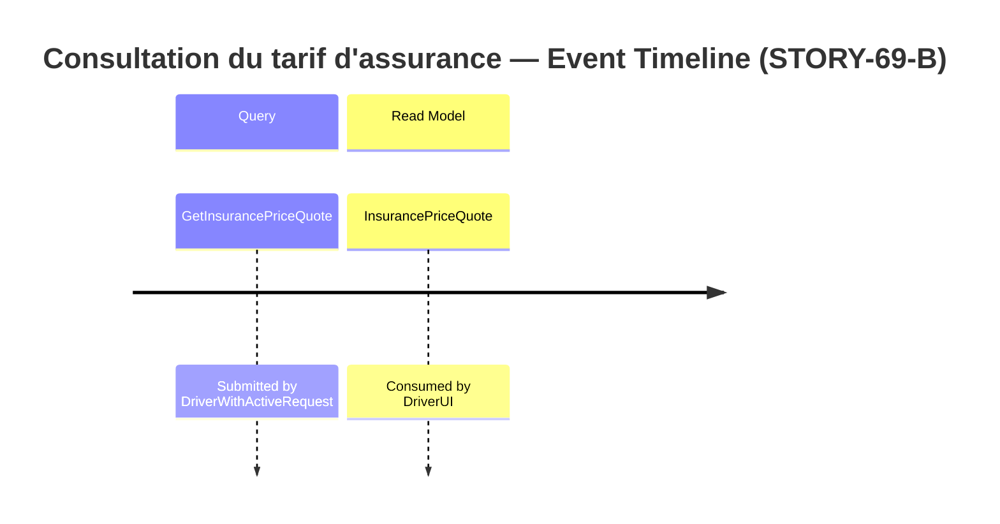
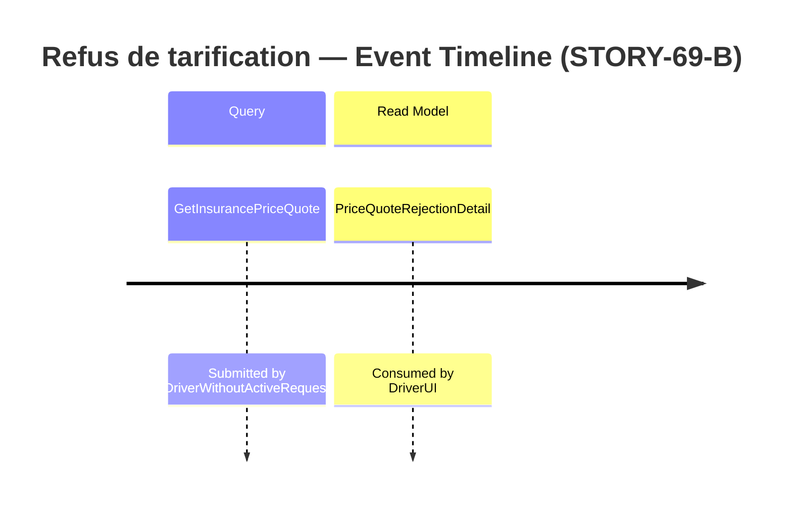

# Event Model — STORY-69: Offre de Souscription

**Story:** STORY-69-A, STORY-69-B
**Date:** 2026-06-02

---

## Slice 1: Initiation de la demande de souscription (STORY-69-A — happy path)

### Trigger → Command → Event → Read Model Mapping

| Step | Name | Description |
|---|---|---|
| Trigger | EligibleDriver action | Le conducteur éligible soumet une demande de souscription |
| Command | `InitiateSubscriptionRequest` | driverId, vehicleType, power (nullable), eligibilityConfirmed: bool |
| Event | `SubscriptionRequestInitiated` | subscriptionReference (SUB-YYYY-NNN), driverId, vehicleType, power, initiatedAt |
| Read Model | `SubscriptionRequestConfirmation` | subscriptionReference, status: "initiated" |

---

## Slice 2: Re-soumission idempotente (STORY-69-A — AC-02)

### Trigger → Command → Read Model Mapping

| Step | Name | Description |
|---|---|---|
| Trigger | EligibleDriver re-soumet | Le conducteur éligible re-soumet une demande déjà existante |
| Command | `InitiateSubscriptionRequest` | même payload que Slice 1 |
| Event | _(aucun)_ | Pas de nouvel événement — la demande existante est retournée |
| Read Model | `SubscriptionRequestConfirmation` | subscriptionReference de la demande existante, status: "initiated" |

---

## Slice 3: Refus si éligibilité non confirmée (STORY-69-A — AC-03)

### Trigger → Command → Event → Read Model Mapping

| Step | Name | Description |
|---|---|---|
| Trigger | UnconfirmedDriver action | Conducteur sans confirmation d'éligibilité tente de créer une demande |
| Command | `InitiateSubscriptionRequest` | eligibilityConfirmed: false |
| Event | `SubscriptionRequestRejected` | reason: "subscription requires prior eligibility confirmation" |
| Read Model | `SubscriptionRequestRejectionDetail` | reason: string |

---

## Slice 4: Consultation du tarif d'assurance (STORY-69-B — happy path)

### Trigger → Query → Read Model Mapping

| Step | Name | Description |
|---|---|---|
| Trigger | DriverWithActiveRequest action | Le conducteur avec une demande active demande un tarif |
| Query | `GetInsurancePriceQuote` | subscriptionReference |
| Event | _(aucun — pas de mutation d'état)_ | Pure lecture + calcul |
| Read Model | `InsurancePriceQuote` | monthlyAmount (decimal), coverageType (string), isPremiumApplied: bool |

---

## Slice 5: Refus si pas de demande active (STORY-69-B — AC-03)

### Trigger → Query → Read Model Mapping

| Step | Name | Description |
|---|---|---|
| Trigger | DriverWithoutActiveRequest action | Conducteur sans demande active tente d'obtenir un tarif |
| Query | `GetInsurancePriceQuote` | subscriptionReference inexistante |
| Event | _(aucun)_ | Pas de mutation |
| Read Model | `PriceQuoteRejectionDetail` | reason: "no active subscription request found" |

---

## Vocabulary cross-check (Phase 9 input)

- `InitiateSubscriptionRequest` trigger classification → `Command` (ratifié par ADR-001)
- `GetInsurancePriceQuote` trigger classification → `Query` (ratifié par ADR-003)
- `SubscriptionRequest` → `Aggregate Root` (ratifié par ADR-001)
- `PricingPolicy` → `Domain Service` (ratifié par ADR-003)
- `SubscriptionRequestInitiated` → `Domain Event` (ratifié par ADR-001)
- `SubscriptionRequestRejected` → `Domain Event` (ratifié par ADR-001)
- `SubscriptionReference` → `Value Object` (ratifié par ADR-001)
- `DriverId` → `Value Object` (ratifié par ADR-001)
- `VehicleDetails` → `Value Object` (ratifié par ADR-001)
- `PriceQuote` → `Value Object` (ratifié par ADR-003)
- `ISubscriptionRequestRepository` → `Repository` (ratifié par ADR-001)
- `SubscriptionRequestConfirmation`, `InsurancePriceQuote`, `PriceQuoteRejectionDetail`, `SubscriptionRequestRejectionDetail` → `Read Model` (ratifié par ADR-001, ADR-003)
