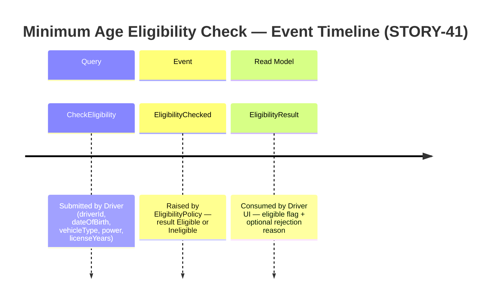

# Event Model — STORY-41: Update minimum driving age to 21

**Story:** STORY-41 — Update minimum driving age to 21  
**Milestone:** v0.3-legal-minimum-age  
**Date:** 2026-05-26

---

## Slice: CheckEligibility (age rule enforcement)

The single deliverable slice for this story is the eligibility check that enforces
the updated minimum age rule. No new command or event type is introduced — the
existing `CheckEligibility` command and `EligibilityChecked` event carry the
updated business rule transparently.

---

## Trigger → Command → Event → Read Model Mapping

| Step | Name | Description |
|---|---|---|
| Trigger | Driver requests eligibility check | Driver submits their details (age, vehicle type) to the portal |
| Query | `CheckEligibility` | Captures driver date of birth, license years, vehicle type, and engine power |
| Event | `EligibilityChecked` | Records the outcome — `Eligible` or `Ineligible` with optional `RejectionReason` |
| Read Model | `EligibilityResult` | Returns `eligible: bool` and `rejectionReason?: string` to the driver portal |

---

## Rule Change Impact on the Event Model

The rule change (`MinimumAge` for Car/Motorcycle: 18 → 21) affects only the
**decision logic** inside `EligibilityPolicy.Evaluate`. The command shape, event
shape, and read model shape are **unchanged**. The same `EligibilityChecked`
event is raised with `Ineligible + "Conducteur trop jeune pour ce véhicule"` for
drivers aged 18–20 applying for a Car or Motorcycle.

---

## Gherkin ↔ Event Model Alignment

| AC | Given (prior state) | When (Command) | Then (Event / Read Model) |
|---|---|---|---|
| AC-01 | Driver aged 20, Car | CheckEligibility | EligibilityChecked(Ineligible, age < 21) |
| AC-02 | Driver aged 21, Car | CheckEligibility | EligibilityChecked(Eligible) |
| AC-03 | Driver aged 20, Motorcycle ≤ 100 hp | CheckEligibility | EligibilityChecked(Ineligible, age < 21) |
| AC-04 | Driver aged 16, ElectricScooter | CheckEligibility | EligibilityChecked(Eligible, age ≥ 16) |
| AC-05 | Driver aged 18, Car | CheckEligibility | EligibilityChecked(Ineligible, age < 21) |
