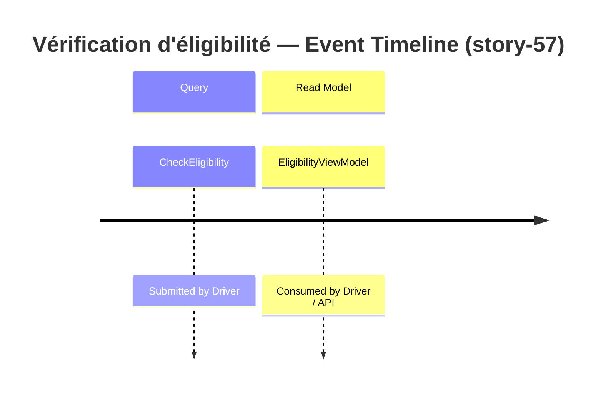

# Event Model — story-57 : Âge légal minimal porté à 21 ans pour les véhicules standards

**Story:** story-57
**Date:** 2026-05-30

## Slice: Vérification d'éligibilité avec la règle d'âge légal mise à jour

## Trigger → Query → Read Model Mapping

| Step | Name | Description |
|---|---|---|
| Trigger | Action du conducteur | Le conducteur soumet une demande de vérification d'éligibilité |
| Query | `CheckEligibility` | Paramètres : date de naissance, type de véhicule, puissance moteur, années de permis |
| Event | — | Aucun événement de domaine : opération en lecture seule, aucun état persisté |
| Read Model | `EligibilityViewModel` | Résultat : `IsEligible` (bool) + `RejectionReason` (string, facultatif) |

> **Justification de l'absence d'événement :** `CheckEligibility` est une Query (cf. ADR-002). Le moteur d'éligibilité retourne un résultat calculé sans persister d'état. Aucun `DomainEvent` n'est émis.

## Vocabulary cross-check (Phase 9 input)

- Trigger classification (`Query`) : DOIT correspondre à ADR-002 qui ratifie la classification Query pour `CheckEligibility`.
- Event emitter : — (aucun — opération en lecture seule).
- `Vehicle` : Value Object — DOIT correspondre à ADR-001.
- `EligibilityPolicy` : Domain Service — DOIT correspondre à ADR-001.
- `EligibilityViewModel` : Read Model — DOIT correspondre à ADR-002.
