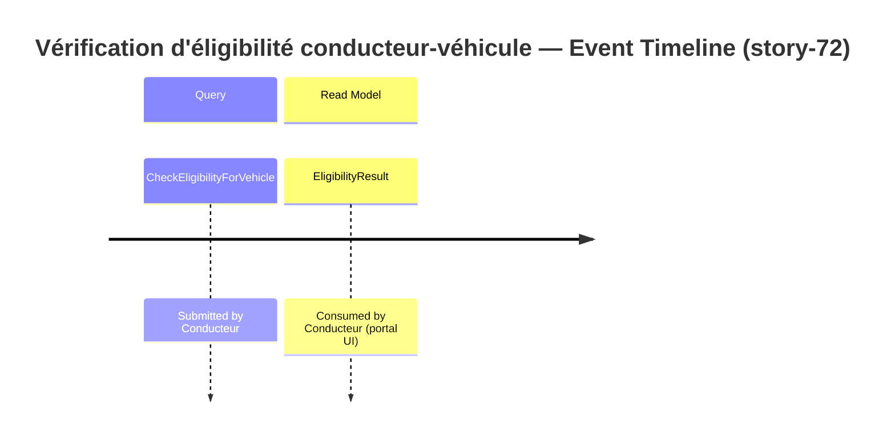

# Event Model — story-72 : Âge légal de conduite porté à 21 ans

**Story:** story-72
**Date:** 2026-06-02

## Slice: Vérification d'éligibilité conducteur-véhicule

> **Note :** Ce slice est une requête pure (aucune mutation d'état, aucun événement de domaine persisté). La règle métier `MinimumAge()` évolue de 18 à 21 ans pour les véhicules non-trottinette ; aucun nouveau flow de persistance n'est introduit.

## Trigger → Query → Read Model Mapping

| Step | Name | Description |
|---|---|---|
| Trigger | Action conducteur | Le conducteur soumet une demande de vérification d'éligibilité avec ses données (date de naissance, années de permis, type et puissance du véhicule) |
| Query | `CheckEligibilityForVehicle` | dateOfBirth: DateOnly, licenseYears: int, vehicleType: VehicleType, power: int? |
| Read Model | `EligibilityResult` | eligible: bool, rejectionReason?: string |

## Vocabulary cross-check (Phase 9 input)

- Trigger classification : `Query` — ratifié par ADR-001 (Vehicle as Value Object) et ADR-002 (EligibilityPolicy as Domain Service) ; la politique est invoquée sans mutation d'état.
- Concepts structurels exposés dans ce slice :
  - `Vehicle` — **Value Object** (adr-001)
  - `Driver` — **Value Object** (adr-001)
  - `EligibilityPolicy` — **Domain Service** (adr-002)
  - `EligibilityResult` — **Value Object** (adr-001)
  - `CheckEligibilityForVehicle` — **Query** (adr-002)
  - `EligibilityViewModel` — **Read Model** (adr-002)

Si Phase 9 signale `CLASSIFICATION_DRIFT` sur l'une de ces lignes, ce fichier est réécrit pour s'aligner sur l'ADR avant persistance.
