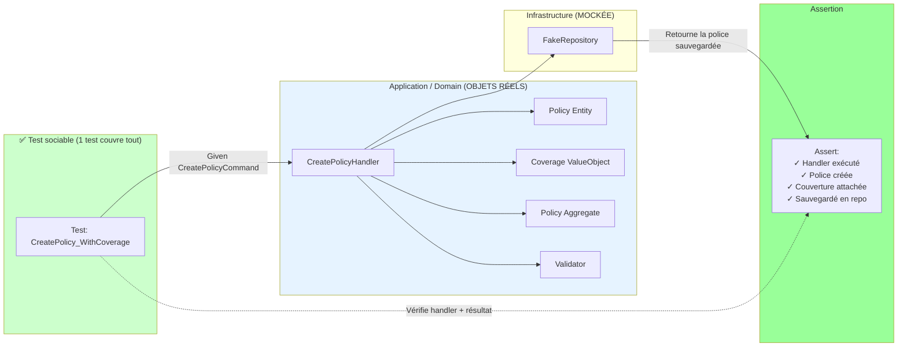
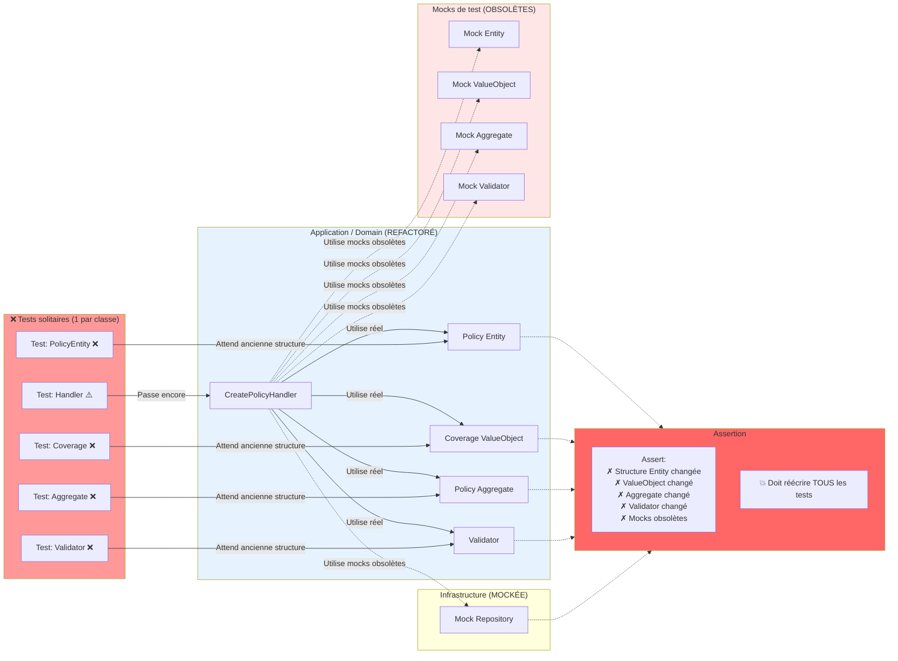

# MonAssurance - Template Clean Architecture

> **Meetup : Coding with AI — Intégrer Copilot sans sacrifier la qualité**  
> **Communauté :** Software Craftsmanship Lille  
> **Animateurs :** François DESCAMPS & Sébastien DEGODEZ (AXA France)  
> **Lieu :** SFEIR  
> 
> Un dépôt compagnon illustrant comment intégrer GitHub Copilot dans le développement quotidien sans sacrifier la qualité du code — avec Clean Architecture, CQRS et TDD en .NET.

---

## 🎯 À propos de ce Meetup

Ce dépôt est le **livrable pratique** de notre talk : **"Coding with AI : Intégrer Copilot sans sacrifier la qualité"** au Software Craftsmanship Lille.

Nous abordons un défi concret : **Comment l'IA peut-elle transformer nos pratiques de développement sans compromettre la qualité du code ?**

### Programme du talk

1. **Connaître ses outils** — Comprendre GitHub Copilot au-delà de l'autocomplétion
2. **Workflows pilotés par l'IA** — Coupler l'IA avec les pratiques qualité (TDD, Clean Architecture)
3. **Primitives Copilot** — Techniques de contexte pour tirer le meilleur de votre assistant IA
4. **Patterns concrets** — Stratégies pratiques pour intégrer Copilot au quotidien

### Point clé

**MonAssurance** démontre que :
- ✅ Copilot accélère le développement sans sacrifier la qualité
- ✅ Les patterns Clean Architecture restent essentiels avec l'IA
- ✅ L'utilisation stratégique des "Primitives Copilot" (instructions, skills, contexte) amplifie la productivité
- ✅ La clarté de la logique métier et la discipline de test comptent plus que jamais

---

## 📚 Vue d'ensemble du projet

**MonAssurance** est un projet vitrine démontrant les pratiques professionnelles de développement logiciel en utilisant **GitHub Copilot** pour maintenir la qualité du code, renforcer les standards d'architecture et accélérer le développement de fonctionnalités. Le projet modélise un **domaine d'assurance automobile** et sert d'outil d'apprentissage pour les équipes adoptant la Clean Architecture en .NET.

### Objectifs principaux
- ✅ Démontrer les principes de **Clean Architecture** avec le DDD (Domain-Driven Design)
- ✅ Implémenter le **pattern CQRS** sans framework externe (pas de MediatR)
- ✅ Valider l'architecture au **compile-time** avec NetArchTest
- ✅ Définir le **vocabulaire métier** (FR↔EN) de manière cohérente
- ✅ Montrer le **développement assisté par IA** avec Copilot pour la qualité du code
- ✅ Fournir des stratégies de test prêtes pour la production (tests sociables, tests d'intégration)


---

## 🚀 Démarrage rapide

### 1. Cloner le dépôt

```bash
git clone https://github.com/SebastienDegodez/meetup-coding-with-ai.git
cd meetup-coding-with-ai
```

### 2. Restaurer les dépendances

```bash
dotnet restore
```

### 3. Compiler la solution

```bash
dotnet build
```

### 4. Lancer les tests

```bash
# Tous les tests
dotnet test

# Tests unitaires uniquement
dotnet test tests/MonAssurance.UnitTests/MonAssurance.UnitTests.csproj

# Tests d'intégration uniquement (nécessite PostgreSQL)
dotnet test tests/MonAssurance.IntegrationTests/MonAssurance.IntegrationTests.csproj

# Tests de conformité architecturale
dotnet test tests/MonAssurance.IntegrationTests/MonAssurance.IntegrationTests.csproj -k "ArchitectureTests"
```

### 5. Démarrer l'API

```bash
dotnet run --project src/MonAssurance.Api/MonAssurance.Api.csproj
```

L'API démarre sur `https://localhost:7092` avec l'interface Swagger à `/swagger`.

---

## 🎓 Fonctionnalités clés

### 1. **Gestion du lexique métier**
Définir la terminologie métier de manière cohérente dans le code et la documentation :

```markdown
# Lexique métier FR → EN

| Français | English |
|----------|---------|
| éligibilité | eligibility |
```

Situé dans [`.github/instructions/business-lexicon.instructions.md`](.github/instructions/business-lexicon.instructions.md)

### 2. **Tests unitaires sociables ou solitaires**

**Tests sociables vs solitaires** ([définition de Martin Fowler](https://martinfowler.com/bliki/UnitTest.html))

#### Le problème : que se passe-t-il quand votre domaine évolue ?

Imaginez que vous devez créer une police d'assurance. Vos règles métier évoluent et vous devez refactorer votre modèle de domaine. **Qu'est-ce qui casse ?**

| Refactoring | Tests cassés | Effort |
|-------------|-------------|--------|
| Découper une Entity en 2 classes | T1, T3, T0 (mocks) | Réécrire 3 tests |
| Ajouter un DomainService | T0 (nouveau mock nécessaire) | Réécrire le test du handler |
| Changer la structure d'un ValueObject | T2, T3, T0 (mocks) | Réécrire 3 tests |
| Déplacer la validation vers l'Aggregate | T3, T4, T0 (mocks) | Réécrire 3 tests |
| Renommer une méthode du Domain | T1, T2, T3, T4, T0 | Réécrire TOUS les tests |
| **Total : 1 refactoring** | **3-5 tests** | **Forte friction** |

La réponse dépend de votre stratégie de test. Deux paradigmes :

---

#### ✅ Tests unitaires sociables : un test couvre tout le comportement



**Scénario de refactoring :** Vous découpez l'Entity `Policy` en `Policy` + `PolicyHolder`, ajoutez un `DomainService`, ou changez la logique de validation.

✅ **Impact :** Le test reste **GREEN** — il vérifie le résultat (police créée avec couverture), pas la façon dont vous y parvenez en interne.

---

#### ❌ Tests unitaires solitaires : un test par classe



---

**Différence clé :**

- **Sociable** = Tester avec les vrais collaborateurs (objets Domain), mocker uniquement les frontières externes (Infrastructure)
- **Solitaire** = Tester en isolation totale, mocker toutes les dépendances y compris les collaborateurs Domain

**Notre choix :** Tests sociables pour la couche Application = meilleure sécurité au refactoring + couverture mutationnelle avec moins de tests.

**Bonus Copilot :** Moins de tests = **efficacité en tokens** + **exécution plus rapide** 🎯
- Sociable : 1 test pour tout le comportement → Moins de code à générer/maintenir avec l'IA + Suite de tests plus rapide
- Solitaire : 5+ tests par fonctionnalité → Plus de prompts, plus de contexte, plus de revues + CI/CD plus lent

---

## 💡 Primitives Copilot et développement assisté par IA

Ce projet met en valeur les **Primitives Copilot** — des techniques structurées pour contextualiser et amplifier votre assistant IA :

### 1. **Fichiers d'instructions** (`.instructions.md`)
Autorité centrale pour la connaissance métier et les standards de code :
- **[Instructions Copilot](.github/copilot-instructions.md)** — Dépendances de développement et stack technique
- **[Instructions du lexique métier](.github/instructions/business-lexicon.instructions.md)** — Terminologie FR↔EN (toujours à jour)
- **[Guide de style C#](.github/instructions/coding-style-csharp.instructions.md)** — Conventions et patterns C#

Copilot lit ces fichiers automatiquement — **aucune pollution de contexte nécessaire**. Suivez les règles, et Copilot les suivra aussi.

### 2. **Skills** (Workflows alimentés par l'IA)
Guides pré-construits pour les tâches récurrentes :
- **TDD depuis Gherkin** — Écrire les scénarios d'abord, Copilot génère les tests
- **Tests de la couche Application** — Patterns de tests sociables pour les handlers CQRS
- **Clean Architecture** — Application des couches et patterns architecturaux
- **Revue de terminologie métier** — Garder le langage métier cohérent

### 3. **Prompting structuré**
Comment nous utilisons efficacement Copilot Chat :

```
❌ Mauvais : "génère un handler"
✅ Bon : "Crée un CommandHandler pour UserRegistration.
          Suis le pattern de l'interface ICommandHandler<T> depuis Application/Shared.
          Utilise FakeItEasy pour le mocking du repository dans les tests.
          Garde la logique métier dans la couche Domain."
```

**Le contexte compte :** Instructions + Exemples + Attentes = Meilleur code

### 4. **Exemples pratiques**

| Tâche | Pattern Copilot |
|-------|-----------------|
| **Test unitaire** | Demander à Copilot de générer à partir des exigences métier + montrer les patterns de test existants |
| **Nouveau handler** | Copilot génère, mais valider qu'il respecte les dépendances entre couches |
| **Revue de PR** | Utiliser Copilot pour vérifier les violations d'architecture + la cohérence du nommage |
| **Documentation** | Demander à Copilot d'écrire la doc à partir du code, puis vérifier l'exactitude |

### 5. **Garde-fous qualité**

Même avec l'assistance de l'IA, maintenir la discipline :
- ✅ **Tests d'abord** — Copilot implémente, il n'invente pas
- ✅ **Validation architecturale** — NetArchTest détecte les violations entre couches
- ✅ **Revue de code** — Le jugement humain sur les décisions de conception
- ✅ **Logique métier** — La garder dans la couche Domain, loin de la plomberie CQRS

---

## 💼 Workflows Copilot recommandés pour votre équipe

1. **BDD-First avec Gherkin & Copilot** :
   - Écrire les scénarios de fonctionnalités en Gherkin (Given-When-Then)
   - Copilot génère le code de test à partir des scénarios
   - Implémenter les handlers pour faire passer les tests

2. **Revues d'architecture** :
   - Copilot signale les violations de dépendances entre couches
   - Vous décidez si l'exception est justifiée

3. **Génération de code** :
   - Handlers, DTOs, mappers (code boilerplate)
   - Copilot fait gagner 30% de temps sur le setup

4. **Documentation** :
   - Copilot rédige les READMEs et la documentation API
   - Vous vérifiez l'exactitude technique

---

## 🧪 Stratégie de test

### Tests unitaires (`MonAssurance.UnitTests`)
- Tests **rapides** et isolés des handlers de la couche Application
- Objets Domain réels, Infrastructure mockée
- Focus sur l'exactitude de la logique métier
- Pas de base de données, pas d'I/O

### Tests d'intégration (`MonAssurance.IntegrationTests`)
- Tests avec une vraie base de données PostgreSQL
- Validation de la persistance des données
- **Tests de conformité architecturale** avec NetArchTest

---

## 📖 Documentation

- **[Plan Clean Architecture](docs/plans/2026-02-26-clean-architecture-template.md)** — Stratégie d'implémentation
- **[Lexique métier](.github/instructions/business-lexicon.instructions.md)** — Terminologie métier FR↔EN
- **[Instructions Copilot](.github/copilot-instructions.md)** — Directives de développement
- **[Guide de style C#](.github/instructions/coding-style-csharp.instructions.md)** — Conventions C#

---

## 🔄 Build & CI/CD

### Build local

```bash
dotnet build
```

### Tests de mutation

```bash
# Lancer les tests de mutation Stryker (configuré dans stryker-config.json)
dotnet stryker
```

Assure la qualité des tests en introduisant des mutations de code et en vérifiant que les tests les détectent.

---

## 👥 Auteurs

| Nom | Organisation |
|-----|--------------|
| **François DESCAMPS** | AXA France |
| **Sébastien DEGODEZ** | AXA France |

---

## 📝 Licence

Ce projet est fourni en l'état à des fins éducatives et de meetup.

---

## 🤝 Contribuer

Ceci est un projet template pour apprendre la Clean Architecture avec Copilot. Les contributions et retours sont les bienvenus !

### Workflow de développement

1. Créer une branche de fonctionnalité : `git checkout -b feature/votre-fonctionnalite`
2. Écrire les tests d'abord (TDD)
3. Implémenter la fonctionnalité
4. Lancer tous les tests : `dotnet test`
5. Commiter avec des messages descriptifs
6. Ouvrir une pull request

---

## ❓ FAQ

### Q : Pourquoi pas MediatR ?
**R :** CQRS est un pattern simple — aucune bibliothèque n'est nécessaire. Nous implémentons la découverte des handlers directement, gardant le code léger et transparent sans dépendances externes.

### Q : Comment ajouter une nouvelle fonctionnalité ?
**R :** Suivre le workflow BDD-First :
1. Écrire les scénarios Gherkin (Given-When-Then)
2. Copilot génère le code de test à partir des scénarios
3. Créer la Command/Query dans la couche Application
4. Implémenter le CommandHandler/QueryHandler pour faire passer les tests
5. Enregistrer dans DependencyInjection.cs
6. Ajouter le endpoint API

### Q : Quand utiliser les Commands vs les Queries ?
**R :**
- **Commands** modifient l'état (Create, Update, Delete)
- **Queries** lisent l'état (Get, Search, List)

---

## 🔗 Ressources

- [Clean Architecture par Robert C. Martin](https://blog.cleancoder.com/uncle-bob/2012/08/13/the-clean-architecture.html)
- [Pattern CQRS](https://martinfowler.com/bliki/CQRS.html)
- [Domain-Driven Design](https://en.wikipedia.org/wiki/Domain-driven_design)
- [Documentation GitHub Copilot](https://docs.github.com/en/copilot)
- [Notes de version .NET 10](https://learn.microsoft.com/en-us/dotnet/core/whats-new/dotnet-10)

---

**Dernière mise à jour :** 2 mars 2026
