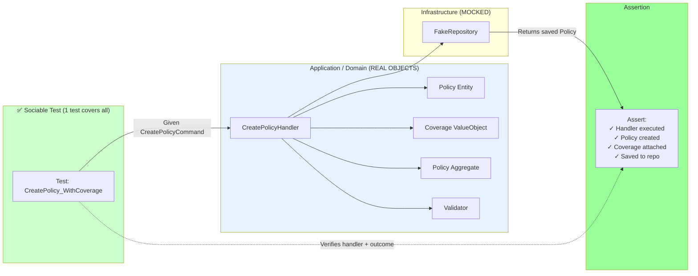
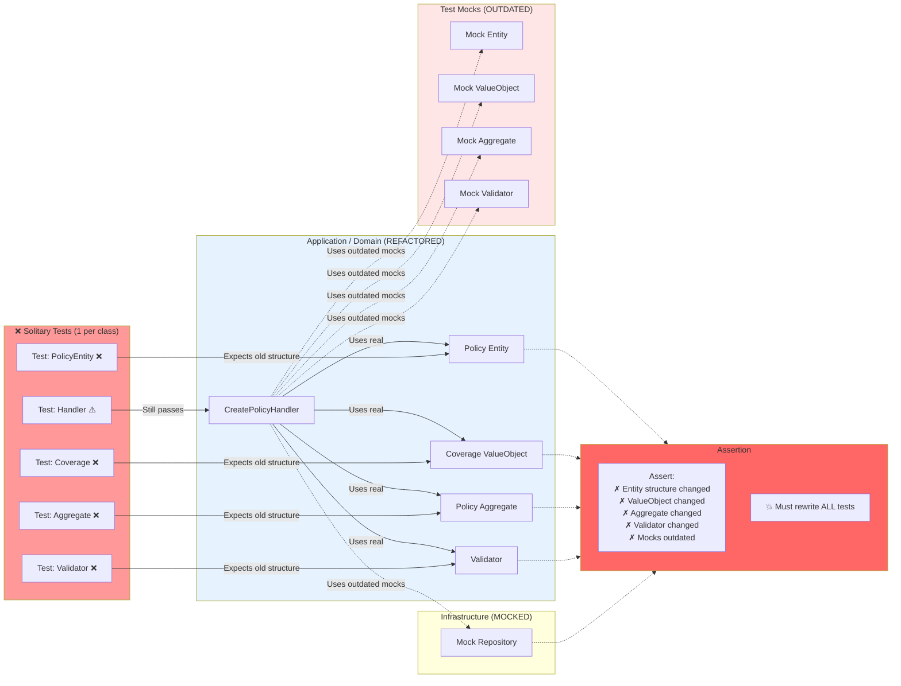

# MonAssurance - Clean Architecture Template

> **Meetup: Coding with AI — Intégrer Copilot sans sacrifier la qualité**  
> **Community:** Software Craftsmanship Lille  
> **Hosts:** François DESCAMPS & Sébastien DEGODEZ (AXA France)  
> **Venue:** SFEIR  
> 
> A hands-on companion repository demonstrating how to integrate GitHub Copilot into daily development without sacrificing code quality — using Clean Architecture, CQRS, and TDD in .NET.

---

## 🎯 About This Meetup

This repository is the **hands-on deliverable** from our talk: **"Coding with AI: Intégrer Copilot sans sacrifier la qualité"** at Software Craftsmanship Lille.

We tackle a real challenge: **How can AI transform our coding practices without compromising code quality?**

### Talk Agenda

1. **Know Your Tools** — Understanding GitHub Copilot beyond autocomplete
2. **AI-Driven Workflows** — Coupling AI with quality practices (TDD, Clean Architecture)
3. **Copilot Primitives** — Context techniques to get the best from your AI assistant
4. **Real-World Patterns** — Practical strategies for integrating Copilot in daily development

### Key Takeaway

**MonAssurance** demonstrates that:
- ✅ Copilot accelerates development without sacrificing quality
- ✅ Clean Architecture patterns remain essential with AI
- ✅ Strategic use of "Copilot Primitives" (instructions, skills, context) amplifies productivity
- ✅ Business logic clarity and testing discipline matter more than ever

---

## 📚 Project Overview

**MonAssurance** is a showcase project demonstrating professional software development practices using **GitHub Copilot** to maintain code quality, enforce architecture standards, and accelerate feature development. The project models an **auto insurance domain** and serves as a learning tool for teams adopting Clean Architecture in .NET.

### Key Objectives
- ✅ Demonstrate **Clean Architecture** principles with DDD (Domain-Driven Design)
- ✅ Implement **CQRS pattern** without external frameworks (no MediatR)
- ✅ Validate architecture at **compile-time** using NetArchTest
- ✅ Define **business domain vocabulary** (FR↔EN) consistently
- ✅ Show **AI-assisted development** with Copilot for code quality
- ✅ Provide production-ready testing strategies (sociable testing, integration tests)


---

## 🚀 Getting Started

### 1. Clone the Repository

```bash
git clone https://github.com/SebastienDegodez/meetup-coding-with-ai.git
cd meetup-coding-with-ai
```

### 2. Restore Dependencies

```bash
dotnet restore
```

### 3. Build the Solution

```bash
dotnet build
```

### 4. Run Tests

```bash
# All tests
dotnet test

# Unit tests only
dotnet test tests/MonAssurance.UnitTests/MonAssurance.UnitTests.csproj

# Integration tests only (requires PostgreSQL)
dotnet test tests/MonAssurance.IntegrationTests/MonAssurance.IntegrationTests.csproj

# Architecture compliance tests
dotnet test tests/MonAssurance.IntegrationTests/MonAssurance.IntegrationTests.csproj -k "ArchitectureTests"
```

### 5. Start the API

```bash
dotnet run --project src/MonAssurance.Api/MonAssurance.Api.csproj
```

The API will start on `https://localhost:7092` with Swagger UI at `/swagger`.

---

## 🎓 Key Features

### 1. **Business Lexicon Management**

Define domain terminology consistently across code and documentation:

```markdown
# FR → EN Business Lexicon

| Français | English |
|----------|---------|
| éligibilité | eligibility |
```

Located at [`.github/instructions/business-lexicon.instructions.md`](.github/instructions/business-lexicon.instructions.md)

### 2. **Sociable or Solitary Unit Testing**

**Sociable vs Solitary Testing** ([Martin Fowler's definition](https://martinfowler.com/bliki/UnitTest.html))

#### The Problem: What happens when your domain evolves?

Imagine you need to create an insurance policy. Your business rules evolve, and you must refactor your domain model. **What breaks?**

| Refactoring | Tests broken | Effort |
|-------------|-------------|--------|
| Split Entity into 2 classes | T1, T3, T0 (mocks) | Rewrite 3 tests |
| Add a DomainService | T0 (new mock needed) | Rewrite handler test |
| Change ValueObject structure | T2, T3, T0 (mocks) | Rewrite 3 tests |
| Move validation to Aggregate | T3, T4, T0 (mocks) | Rewrite 3 tests |
| Rename a Domain method | T1, T2, T3, T4, T0 | Rewrite ALL tests |
| **Total: 1 refactoring** | **3-5 tests** | **High friction** |

The answer depends on your testing strategy. Two paradigms:

---

#### ✅ Sociable Unit Testing: One Test Covers Entire Behavior



**Refactoring Scenario:** You split `Policy` Entity into `Policy` + `PolicyHolder`, add a `DomainService`, or change validation logic.

✅ **Impact:** Test stays **GREEN** — it verifies the outcome (policy created with coverage), not how you achieved it internally.

---

#### ❌ Solitary Unit Testing: One Test Per Class



---

**Key Difference:**

- **Sociable** = Test with real collaborators (Domain objects), mock only external boundaries (Infrastructure)
- **Solitary** = Test in complete isolation, mock all dependencies including Domain collaborators

**Our Choice:** Sociable testing for Application layer = better refactoring safety + mutation coverage with fewer tests.

**Copilot Bonus:** Fewer tests = **token efficient** + **faster execution** 🎯
- Sociable: 1 test for entire behavior → Less code to generate/maintain with AI + Faster test suite
- Solitary: 5+ tests per feature → More prompts, more context, more reviews + Slower CI/CD
---

## 💡 Copilot Primitives & AI-Assisted Development

This project showcases **Copilot Primitives** — structured techniques to contextualize and amplify your AI assistant:

### 1. **Instructions Files** (`.instructions.md`)
Central authority for domain knowledge and coding standards:
- **[Copilot Instructions](.github/copilot-instructions.md)** — Development dependencies & tech stack
- **[Business Lexicon Instructions](.github/instructions/business-lexicon.instructions.md)** — FR↔EN terminology (always up-to-date)
- **[Coding Style Guide](.github/instructions/coding-style-csharp.instructions.md)** — C# conventions & patterns

Copilot reads these automatically—**no context pollution needed**. Just follow the rules, and Copilot will too.

### 2. **Skills** (AI-Powered Workflows)
Pre-built guidance for recurring tasks:
- **TDD from Gherkin** — Write scenarios first, Copilot generates tests
- **Application Layer Testing** — Sociable testing patterns for CQRS handlers
- **Clean Architecture** — Layer enforcement and architectural patterns
- **Business Terminology Review** — Keep domain language consistent

### 3. **Structured Prompting**
How we use Copilot Chat effectively:

```
❌ Bad: "generate a handler"
✅ Good: "Create a CommandHandler for UserRegistration. 
          Follow ICommandHandler<T> interface pattern from Application/Shared.
          Use FakeItEasy for repository mocking in tests.
          Keep business logic in the Domain layer."
```

**Context matters:** Instructions + Examples + Expectations = Better code

### 4. **Practical Examples**

| Task | Copilot Pattern |
|------|-----------------|
| **Unit Test** | Ask Copilot to generate from business requirements + show existing test patterns |
| **New Handler** | Copilot generates, but validate it respects layer dependencies |
| **PR Review** | Use Copilot to check for architecture violations + naming consistency |
| **Documentation** | Ask Copilot to write docs from code, then review for accuracy |

### 5. **Quality Safeguards**

Even with AI assistance, maintain discipline:
- ✅ **Tests first** — Copilot implements, not invents
- ✅ **Architecture validation** — NetArchTest catches layer violations
- ✅ **Code review** — Human judgment on design decisions
- ✅ **Business logic** — Keep this in Domain layer, away from CQRS plumbing

---

## 💼 Recommended Copilot Workflows for Your Team

1. **BDD-First with Gherkin & Copilot**: 
   - Write feature scenarios in Gherkin (Given-When-Then)
   - Copilot generates test code from scenarios
   - Implement handlers to make tests pass
   
2. **Architecture Reviews**: 
   - Copilot flags layer dependency violations
   - You decide if exception is justified
   
3. **Code Generation**: 
   - Handlers, DTOs, mappers (boilerplate)
   - Copilot saves 30% time on setup
   
4. **Documentation**: 
   - Copilot writes READMEs and API docs
   - You verify technical accuracy

---

## 🧪 Testing Strategy

### Unit Tests (`MonAssurance.UnitTests`)
- **Fast**, isolated tests of Application layer handlers
- Real Domain objects, mocked Infrastructure
- Focuses on business logic correctness
- No database, no I/O

### Integration Tests (`MonAssurance.IntegrationTests`)
- Tests with real PostgreSQL database
- Validates data persistence
- **Architecture compliance tests** using NetArchTest

---

## 📖 Documentation

- **[Clean Architecture Plan](docs/plans/2026-02-26-clean-architecture-template.md)** — Implementation strategy
- **[Business Lexicon](.github/instructions/business-lexicon.instructions.md)** — FR↔EN domain terminology
- **[Copilot Instructions](.github/copilot-instructions.md)** — Development guidelines
- **[Coding Style Guide](.github/instructions/coding-style-csharp.instructions.md)** — C# conventions

---

## 🔄 Build & CI/CD

### Local Build

```bash
dotnet build
```

### Mutation Testing

```bash
# Run Stryker mutation tests (configured in stryker-config.json)
dotnet stryker
```

Ensures test quality by introducing code mutations and verifying tests catch them.

---

## 👥 Authors

| Name | Organization |
|------|--------------|
| **François DESCAMPS** | AXA France |
| **Sébastien DEGODEZ** | AXA France |

---

## 📝 License

This project is provided as-is for educational and meetup purposes.

---

## 🤝 Contributing

This is a template project for learning Clean Architecture with Copilot. Contributions and feedback are welcome!

### Development Workflow

1. Create a feature branch: `git checkout -b feature/your-feature`
2. Write tests first (TDD)
3. Implement the feature
4. Run all tests: `dotnet test`
5. Commit with descriptive messages
6. Open a pull request

---

## ❓ FAQ

### Q: Why no MediatR?
**A:** CQRS is a simple pattern—no library needed. We implement handler discovery directly, keeping the code lightweight and transparent without external dependencies.

### Q: How do I add a new feature?
**A:** Follow BDD-First workflow:
1. Write Gherkin scenarios (Given-When-Then)
2. Copilot generates test code from scenarios
3. Create Command/Query in Application layer
4. Implement CommandHandler/QueryHandler to make tests pass
5. Register in DependencyInjection.cs
6. Add API endpoint

### Q: When do I use Commands vs. Queries?
**A:** 
- **Commands** modify state (Create, Update, Delete)
- **Queries** read state (Get, Search, List)

---

## 🔗 Resources

- [Clean Architecture by Robert C. Martin](https://blog.cleancoder.com/uncle-bob/2012/08/13/the-clean-architecture.html)
- [CQRS Pattern](https://martinfowler.com/bliki/CQRS.html)
- [Domain-Driven Design](https://en.wikipedia.org/wiki/Domain-driven_design)
- [GitHub Copilot Documentation](https://docs.github.com/en/copilot)
- [.NET 10 Release Notes](https://learn.microsoft.com/en-us/dotnet/core/whats-new/dotnet-10)

---

**Last Updated:** March 2, 2026  
